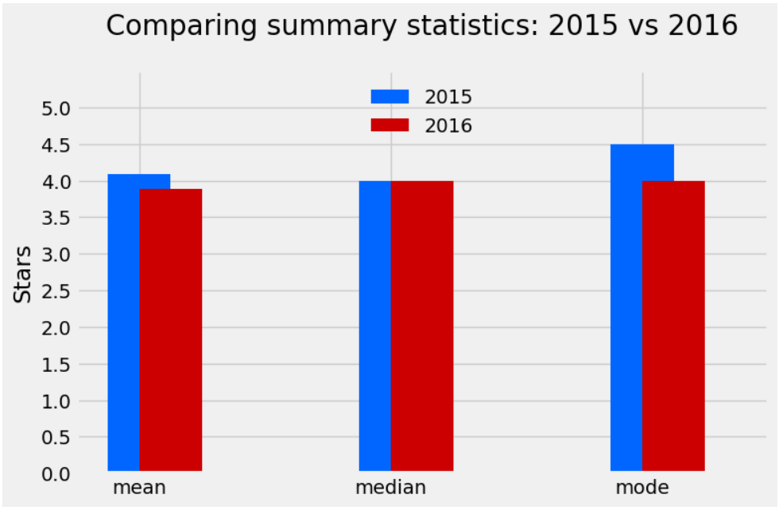

# Fandango Ratings

Walt Hickey, a data journalist in October 2015, was determined to discover the accuracy of Fandango movie ratings, which use a 1-5 star system. To his surprise, he found, using the HTML data from Fandango, that they were rounding up all their ratings to the next half star! For example, if a film had a rating of 3.1, they would round it up to 3.5 instead of down to 3. Walt Hickey published his findings in [an article](https://fivethirtyeight.com/features/fandango-movies-ratings/). When Fandango read it, they claimed that there had been an error in their calculations, that it had not been intentional, and that they would fix the ratings immediately.

This brings us to the guided Dataquest project I am constructing today. The goal of this project is simple: to examine the Fandango ratings from 2016 and 2017 to see if they indeed kept their word and corrected their review values.

View this project live on Google Colab [here](https://colab.research.google.com/drive/1jf-hmG9u-l6wAcbvwcuPfP29sKA25yo4?usp=sharing).
